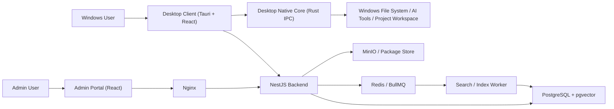
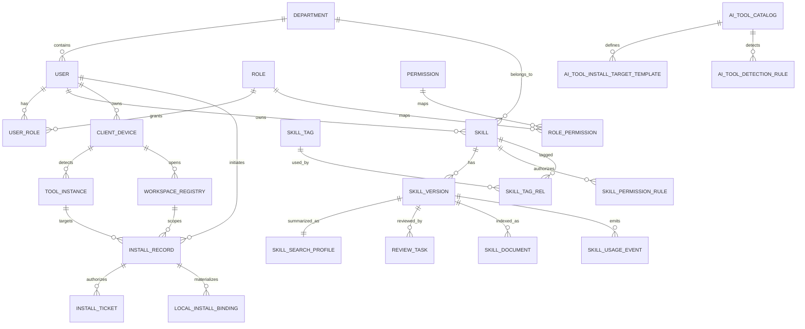

# 企业内网 Agent Skills 管理市场设计方案

## 1. 目标与约束

- 目标：构建企业内网部署的 Agent Skills 管理市场，支持 Skill 发布、审核、授权、搜索、安装、使用统计与本地多环境分发。
- 部署：服务端统一部署在 Linux 服务器，Nginx 反向代理，PostgreSQL 为主数据库。
- 用户：主要是 Windows 终端用户，需支持扫描本地 AI 工具路径并一键安装 Skill。
- 规模：500-3000 用户，约 1 万级 Skill。
- 技术路线：TypeScript + React + Tauri + Rust + NestJS + PostgreSQL + pgvector + Redis（任务队列/缓存）。
- 研发环境：开发机主要为 macOS，需要支持跨平台开发、联调和测试。

## 2. 推荐总体架构

推荐采用“模块化单体 + 独立检索管线”的架构。

### 2.1 逻辑组件

1. Desktop Client（Windows）
   - Tauri + React 桌面客户端。
   - 提供登录、Skill 浏览、搜索推荐、收藏评价、本地工具扫描、全局安装、项目安装、卸载和本地状态查看。

2. Admin Portal（Web）
   - React 管理后台。
   - 仅面向管理员、审核员、部门管理员使用。
   - 提供用户管理、部门管理、权限授予、审核流、工具路径模板维护、统计看板。

3. API Gateway / Backend（NestJS）
   - 统一对外 API。
   - 承担 IAM、RBAC、Skill 生命周期、审核流、安装任务编排、统计聚合、审计日志。

4. Search / Index Worker
   - 处理 Skill 内容抽取、切片、向量化、索引更新。
   - 提供检索召回、重排候选、搜索缓存。

5. PostgreSQL
   - 业务主库。
   - 使用 `pgvector` 存储向量。

6. Redis
   - BullMQ 队列、检索缓存、短期安装态缓存。

7. Object Storage / Package Store
   - 存储 Skill 压缩包、审核附件、版本文件。
   - 内网可用 MinIO 或直接 Linux 文件存储。

8. Desktop Native Core（Rust）
   - 内嵌在桌面客户端中，负责本机 AI 工具扫描、路径登记、安装/卸载、项目目录选择、安装结果回传。
   - 通过 Tauri IPC 与桌面前端通信，不再暴露 localhost 接口给浏览器。

### 2.2 交互流程

#### A. Skill 发布与审核

1. 用户或管理员在管理后台上传 Skill 包、描述、分类、标签、适配工具、可见范围。
2. Backend 保存元数据和文件，创建 `skill_version`、`review_task`。
3. 审核通过后，Skill 状态由 `DRAFT/PENDING_REVIEW` 变为 `PUBLISHED`。
4. Index Worker 异步抽取 Skill 内容，生成 embedding，写入向量索引表。

#### B. Skill 搜索与推荐

1. 用户在桌面客户端输入自然语言查询。
2. Backend 先做权限过滤，生成可见 Skill 范围约束。
3. Search Worker 先在“一阶段索引”中执行“权限约束 + metadata filter + 轻量向量检索 + 关键字召回”，拿到候选 Skill 版本集合。
4. Search Worker 再在“二阶段索引”中对候选集合做分块向量检索与语义补强。
5. 将候选集合交给 LLM 做摘要与排序解释，返回推荐结果。

#### C. 一键安装

1. 桌面客户端读取本机 Native Core 状态与已发现工具列表。
2. 用户点击“一键安装”，桌面前端通过 Tauri IPC 调用 Native Core 预览本地可安装目标。
3. Desktop UI 将“本地扫描结果 + 用户选择的 scope/workspace + 目标工具实例”提交给 Backend 申请 `install ticket`。
4. Backend 完成权限校验、模板 revision 选择、manifest 快照固化，并签发一次性或幂等可重试的安装票据。
5. Native Core 使用 `ticket` 拉取安装清单、签名文件与目标路径解析参数，完成本地安装。
6. Native Core 安装成功后回传安装结果与遥测事件。

## 3. 系统架构图说明



### 3.1 模块边界

- 桌面前端负责普通用户交互，所有本地能力通过 IPC 调 Native Core。
- 管理后台只负责管理类页面，不承担本地扫描和安装。
- NestJS 统一承担鉴权、业务规则、审核、安装任务签发。
- Search Worker 独立处理 CPU 密集型 embedding 与检索任务。
- Desktop Native Core 只负责“本地环境事实”和“本地文件动作”，不承载企业权限逻辑。

### 3.2 最终版系统架构说明

最终定稿架构采用“三端分层、权限归后端、本地能力归 Native Core”的责任划分：

1. 用户操作面
   - 普通用户仅使用 Windows 桌面客户端。
   - 管理员、审核员、部门管理员使用 Web 管理后台。
   - 两类前端共用同一套 Backend 权限与业务模型，但调用边界不同。

2. 业务控制面
   - NestJS 是唯一权威控制面，负责认证、授权、Skill 生命周期、审核流、安装票据、审计与统计。
   - 所有“是否允许看见、安装、升级、回滚某个 Skill”的判断都在服务端完成。
   - 桌面端只拿到结果化指令，不在本地复制一套权限引擎。

3. 本地执行面
   - Rust Native Core 内嵌在 Tauri 桌面客户端内，通过 IPC 提供工具探测、路径解析、文件落盘、升级、卸载、回滚、校验等能力。
   - Native Core 不是独立 Daemon，不对浏览器开放 `localhost` 端口，也不承担 Web 页面的跨进程桥接职责。

4. 检索与异步处理面
   - Search / Index Worker 负责内容抽取、分块、embedding、索引刷新与检索重排。
   - BullMQ + Redis 负责异步索引、统计聚合、安装回执处理等后台任务。

5. 存储面
   - PostgreSQL 保存业务数据、权限模型、工具模板、安装记录与向量索引。
   - MinIO 或 Linux 文件存储保存 Skill 包、审核附件、构建产物。

这意味着平台主链路必须始终遵守：

- 管理端不直接触达本地文件系统。
- 桌面前端不直接写 AI 工具目录。
- Native Core 不直接访问数据库。
- 所有本地安装动作都必须先拿到 Backend 签发的 install ticket / manifest。

## 4. 建议技术栈

### 4.1 前端

- React + TypeScript
- Ant Design 或 Semi Design 作为后台组件库
- TanStack Query 处理服务端状态
- WebSocket/SSE 处理审核状态与安装进度推送
- 桌面端通过 Tauri IPC 调用原生能力，不使用浏览器 localhost 通信

### 4.2 服务端

- NestJS
- Prisma 或 TypeORM（二选一，推荐 Prisma 做模式管理）
- BullMQ + Redis
- JWT + Session 双模式
- LDAP/SSO 预留为 `auth_provider`

### 4.3 检索

- PostgreSQL + `pgvector`
- 文本分词：中英文混合 tokenizer
- Embedding：
  - 首选内网 CPU 可部署的轻量模型，服务化运行
  - 示例策略：中文场景选择 bge-m3 / bge-small-zh 类模型
- Rerank：
  - 初期可用规则重排 + metadata boosting
  - 后续再引入轻量 reranker

### 4.4 本地客户端

- Windows Desktop Client：`Tauri + React`
- Native Core：`Rust`
- 如果强调桌面授权弹窗、文件选择器、系统托盘和自动更新，推荐 Tauri
- 本方案优先推荐：Tauri UI Shell + Rust Native Core

## 5. 数据库核心 ER 设计

## 5.1 核心实体

### user

- id
- username
- display_name
- email
- employee_no
- department_id
- status
- password_hash
- auth_source (`local`, `ldap`, `sso`)
- last_login_at
- created_at
- updated_at

### department

- id
- name
- code
- parent_id
- path
- created_at

说明：支持部门树，便于“本部门及子部门可见”的授权。

### role

- id
- code
- name
- description

### permission

- id
- code
- name
- resource
- action

### user_role

- user_id
- role_id
- scope_type (`global`, `department`, `personal`)
- scope_ref_id

### role_permission

- role_id
- permission_id

### skill

- id
- skill_key
- name
- summary
- description
- owner_user_id
- owner_department_id
- category_id
- status (`draft`, `pending_review`, `published`, `rejected`, `archived`)
- visibility_type (`public`, `department`, `private`)
- current_version_id
- average_rating
- favorite_count
- install_count
- invoke_count
- created_at
- updated_at

### skill_version

- id
- skill_id
- version
- package_uri
- manifest_json
- readme_text
- changelog
- ai_tools_json
- install_mode_json
- checksum
- signature
- review_status
- stage1_index_status (`pending`, `processing`, `ready`, `failed`)
- stage2_index_status (`pending`, `processing`, `ready`, `failed`)
- search_ready_at
- published_at
- created_by
- created_at

说明：两阶段索引状态挂在 `skill_version` 上，避免仅凭 Skill 主表状态误判某个版本是否“可搜”。

### skill_search_profile

- id
- skill_version_id
- title_text
- summary_text
- tag_text
- category_text
- supported_tools_json
- keyword_document
- metadata_json
- head_embedding vector
- created_at
- updated_at

说明：一阶段索引表。每个 Skill 版本一条主搜索画像，用于轻量召回，不替代二阶段分块索引。

### skill_category

- id
- name
- parent_id

### skill_tag

- id
- name

### skill_tag_rel

- skill_id
- tag_id

### skill_permission_rule

- id
- skill_id
- rule_type (`view`, `use`, `manage`)
- subject_type (`all`, `department`, `user`)
- subject_ref_id
- effect (`allow`, `deny`)

说明：该表是精细授权核心。`visibility_type` 做粗粒度展示，`skill_permission_rule` 做最终裁决。

### review_task

- id
- skill_version_id
- submitter_id
- reviewer_id
- status
- comment
- created_at
- reviewed_at

### skill_favorite

- user_id
- skill_id
- created_at

### skill_rating

- id
- user_id
- skill_id
- rating
- comment
- created_at

### install_record

- id
- operation_type (`install`, `upgrade`, `uninstall`, `rollback`)
- user_id
- skill_id
- skill_version_id
- previous_skill_version_id
- target_scope (`global`, `project`)
- tool_instance_id
- install_target_template_id
- workspace_registry_id
- resolved_target_path
- lock_key
- idempotency_key
- manifest_snapshot_json
- install_status (`pending`, `downloading`, `installing`, `verifying`, `success`, `failed`, `rolled_back`)
- source_client_id
- error_code
- error_message
- trace_id
- started_at
- finished_at
- created_at

说明：`install_record` 记录一次操作，不仅记录安装，也记录升级、卸载、回滚。

### install_ticket

- id
- ticket_id
- install_record_id
- user_id
- client_device_id
- tool_instance_id
- workspace_registry_id
- install_target_template_id
- ticket_scope (`install`, `upgrade`, `uninstall`, `rollback`, `verify`)
- status (`issued`, `consumed`, `expired`, `cancelled`)
- manifest_snapshot_json
- expires_at
- consumed_at
- idempotency_key
- created_at

说明：`install_ticket` 是安装治理主链路的授权载体，必须持久化，以支持短时效、一致审计、重放防护和幂等重试。

### tool_instance

- id
- user_id
- client_device_id
- tool_id
- tool_version
- os_type
- detected_install_path
- detected_config_path
- discovered_targets_json
- detection_source (`auto`, `manual`, `imported`)
- trust_status (`detected`, `verified`, `disabled`)
- last_scanned_at
- created_at
- updated_at

说明：存“用户机器上发现了哪些 AI 工具实例”，实际可安装目标仍需结合模板表动态解析。

### workspace_registry

- id
- user_id
- client_device_id
- workspace_name
- workspace_path
- repo_remote
- repo_branch
- project_fingerprint
- created_at
- last_used_at

### client_device

- id
- user_id
- device_fingerprint
- device_name
- os_type
- os_version
- desktop_app_version
- native_core_version
- last_seen_at
- status (`active`, `revoked`, `offline`)
- created_at
- updated_at

说明：保留“桌面设备”概念用于信任管理和安装回执，命名统一收敛为 `client_device`。

### ai_tool_catalog

- id
- tool_code
- tool_name
- vendor
- tool_family
- supported_os_json
- official_doc_url
- status (`active`, `deprecated`, `experimental`)
- created_at
- updated_at

### ai_tool_install_target_template

- id
- tool_id
- template_code
- template_revision
- os_type
- artifact_type (`skill`, `rule`, `instruction`, `config`, `agents_md`)
- scope_type (`global`, `project`)
- template_name
- target_path_template
- filename_template
- packaging_mode (`single_file`, `directory`, `merge`, `append`)
- content_management_mode (`replace`, `managed_block`)
- managed_block_marker
- path_variables_json
- min_tool_version
- max_tool_version
- priority
- is_default
- release_status (`active`, `retired`, `draft`)
- supersedes_template_id
- verification_status (`verified`, `candidate`, `deprecated`)
- source_reference_url
- created_at
- updated_at

说明：该表按“不可变 revision”管理。模板一旦下发生产，不做原地覆盖修改，只新增 revision 并切换默认版本。

### ai_tool_detection_rule

- id
- tool_id
- os_type
- detection_type (`path_exists`, `registry`, `process`, `config_file`)
- rule_expr
- expected_install_path
- expected_config_path
- expected_target_path
- priority
- is_active
- created_at
- updated_at

### local_install_binding

- id
- client_device_id
- tool_instance_id
- skill_id
- skill_version_id
- install_record_id
- target_scope
- workspace_registry_id
- install_target_template_id
- resolved_target_path
- state (`active`, `removed`, `drifted`)
- installed_at
- last_verified_at
- removed_at

### skill_usage_event

- id
- user_id
- client_device_id
- skill_id
- skill_version_id
- tool_instance_id
- workspace_registry_id
- event_type (`install`, `upgrade`, `uninstall`, `rollback`, `invoke`, `verify`)
- event_source (`desktop_ui`, `native_core`, `worker`)
- event_time
- dedupe_key
- payload_json
- created_at

说明：用于承接“使用统计”与排行榜计算。`invoke` 事件按工具可观测能力 best-effort 上报，不与安装事件混淆。

### audit_log

- id
- actor_user_id
- action
- resource_type
- resource_id
- payload_json
- ip
- created_at

### skill_document

- id
- skill_version_id
- chunk_index
- content
- token_count
- metadata_json
- embedding vector
- created_at

说明：用于 RAG 检索的切片表。

## 5.2 关键关系

- `department 1:N user`
- `user N:M role` 通过 `user_role`
- `role N:M permission` 通过 `role_permission`
- `skill 1:N skill_version`
- `skill_version 1:1 skill_search_profile`
- `skill N:M tag` 通过 `skill_tag_rel`
- `skill 1:N skill_permission_rule`
- `skill_version 1:N review_task`
- `skill_version 1:N skill_document`
- `user 1:N client_device`
- `client_device 1:N tool_instance`
- `client_device 1:N workspace_registry`
- `user 1:N install_record`
- `install_record 1:1..N install_ticket`
- `ai_tool_catalog 1:N ai_tool_install_target_template`
- `ai_tool_catalog 1:N ai_tool_detection_rule`
- `tool_instance 1:N install_record`
- `workspace_registry 1:N install_record`
- `install_record 1:1..N local_install_binding`
- `skill_version 1:N skill_usage_event`

## 5.3 最终版数据库 ER



ER 定稿说明：

- 服务端保存“模板、规则、安装记录、同步快照”，不保存任何必须依赖客户端实时内存的路径状态。
- `tool_instance` 代表扫描结果，`ai_tool_install_target_template` 代表平台知识，二者组合后才形成最终落盘路径。
- `local_install_binding` 代表某个 Skill 在某台设备某个工具实例上的当前落地事实，是“我的已安装”页面与回滚能力的关键锚点。

## 6. 权限模型设计

### 6.1 权限分层

1. 平台级 RBAC
   - 控制“谁能上传、审核、下架、查看报表、管理分类”。

2. Skill 级 ABAC/RBAC 混合
   - 控制“谁能看到 Skill、谁能安装 Skill、谁能管理 Skill”。

3. 桌面客户端与设备级约束
   - 控制“哪些桌面设备可以代表哪个用户执行安装、升级、卸载与回滚”。

### 6.2 推荐可见性判定顺序

1. 管理员角色直接放行
2. `visibility_type=public` 且无显式 deny
3. `visibility_type=department` 且用户部门命中规则
4. `visibility_type=private` 且用户是 owner 或被显式授权
5. 若存在 `deny` 规则，优先级高于 `allow`

## 7. API 边界与接口设计建议

### 7.1 管理端 / 桌面端 / 后端 边界

| 调用方 | 可以调用 | 不应直接调用 |
|---|---|---|
| Admin Portal | Backend 的 IAM、审核、Skill 管理、工具模板管理、统计 API | Native Core IPC、本地文件系统、数据库 |
| Desktop UI | Backend 的用户态 API；Tauri IPC 暴露的本地命令 | Admin 专属 API、数据库、Redis |
| Native Core | Backend 的设备注册、安装票据、manifest、安装回执 API；本地文件系统 | 审核流 API、管理后台 API、数据库 |
| Search / Index Worker | PostgreSQL、Redis、对象存储、内部任务队列 | 桌面 IPC、前端页面接口 |

最终边界要求：

- 管理后台不再承担任何“触发本机安装”的职责。
- 桌面 UI 只编排，不直接落盘。
- Native Core 只执行票据授权后的本地动作，不自行决定是否越权安装。
- Backend 是唯一的策略、权限和审计中心。

### 7.2 Auth / IAM

- `POST /api/auth/login`
- `POST /api/auth/logout`
- `GET /api/auth/me`
- `POST /api/auth/ldap/callback`
- `GET /api/departments/tree`
- `GET /api/users`
- `POST /api/users/:id/roles`

### 7.3 管理端 API（Admin Portal -> Backend）

- `POST /api/skills`
- `PUT /api/skills/:id`
- `POST /api/skills/:id/versions`
- `POST /api/skills/:id/submit-review`
- `POST /api/reviews/:id/approve`
- `POST /api/reviews/:id/reject`
- `POST /api/skills/:id/publish`
- `POST /api/skills/:id/archive`
- `GET /api/admin/reviews`
- `GET /api/admin/audit-logs`
- `GET /api/admin/ai-tools`
- `POST /api/admin/ai-tools`
- `POST /api/admin/ai-tool-templates`
- `POST /api/admin/ai-tool-detection-rules`

### 7.4 桌面用户态 API（Desktop UI -> Backend）

- `GET /api/skills`
- `GET /api/skills/:id`
- `POST /api/skills/:id/favorite`
- `DELETE /api/skills/:id/favorite`
- `POST /api/skills/:id/rating`
- `GET /api/leaderboards`
- `GET /api/dashboard/overview`
- `POST /api/search/skills`
- `GET /api/search/suggestions`
- `POST /api/search/feedback`
- `POST /api/skill-usage/report`
- `POST /api/client-devices/register`
- `POST /api/client-devices/heartbeat`
- `POST /api/tool-instances/report`
- `POST /api/workspaces/report`
- `POST /api/install-tickets`
- `GET /api/install-tickets/:ticketId/manifest`
- `POST /api/install-tickets/:ticketId/consume`
- `POST /api/install-operations/:id/report`
- `GET /api/my/installs`
- `GET /api/my/tool-instances`
- `GET /api/my/workspaces`

### 7.5 Tauri IPC / Native Core API（Desktop UI -> Native Core）

- `scan_tools`
- `list_tool_instances`
- `select_workspace`
- `preview_install_target`
- `apply_install_ticket`
- `upgrade_installation`
- `uninstall_installation`
- `rollback_installation`
- `verify_installation`
- `list_local_installs`

### 7.6 后端内部边界（Backend <-> Worker）

- `IndexJob`：Skill 包解析、切片、embedding、索引刷新
- `SearchJob`：大查询量场景下的异步重排或缓存回填
- `MetricsJob`：安装统计、排行榜聚合
- `ReconcileJob`：客户端上报与服务端快照一致性校验

## 8. 难点 A：Agent + RAG 智能搜索设计

## 8.1 问题拆解

当用户输入自然语言，例如“帮我找一个能自动生成前后端 API 接口的工具”时，系统需要完成四件事：

1. 理解意图：这是“代码生成 / 接口生成 / 前后端协同”的需求。
2. 权限约束：只能在用户可见、可用的 Skill 范围里检索。
3. 混合召回：从 1 万级 Skill 中找出语义相关、标签相关、工具兼容相关的候选。
4. 结果组织：用 LLM 解释为什么推荐，并输出可执行建议。

## 8.2 Skill 向量化对象

两阶段索引必须拆成两类对象，而不是只维护一个切片表：

1. 一阶段索引对象：`skill_search_profile`
   - 每个 Skill 版本一条
   - 只放标题、简介、标签、分类、适配工具等轻量信息
   - 用于快速权限约束后的首轮召回

2. 二阶段索引对象：`skill_document`
   - 每个 Skill 版本拆成多个文档块
   - 放 README、Prompt、Manifest、示例、审核摘要等长文本
   - 用于在候选集合内做语义补强与精排

其中二阶段文档块建议包括：

1. 标题块
   - Skill 名称、简介、标签、分类、适配工具
2. Readme/说明块
   - 功能描述、使用方式、输入输出
3. Prompt/模板块
   - 核心 prompt 或指令样例
4. Manifest/配置块
   - 支持哪些工具、依赖哪些文件、安装到什么位置
5. 审核/质量摘要块
   - 管理员审核意见、质量标签、最佳使用场景

标题块的轻量主画像写入 `skill_search_profile`，其余分块 embedding 写入 `skill_document`。

## 8.3 上传后的索引流程

```text
用户上传 Skill
-> Backend 保存 skill_version
-> 投递 Stage1IndexJob 到 BullMQ
-> Worker 构建 skill_search_profile
-> 写入 metadata / keyword_document / head_embedding
-> 更新 skill_version.stage1_index_status = ready
-> 投递 Stage2IndexJob 到 BullMQ
-> Worker 解压包并抽取 README / Prompt / Manifest / 示例
-> 规范化清洗（去模板噪音、保留标签/用途/工具元信息）
-> 切片（建议 300-800 tokens）
-> 生成 embedding
-> 写入 skill_document(embedding)
-> 更新 skill_version.stage2_index_status = ready
-> 当 stage1/stage2 都 ready 时写入 skill_version.search_ready_at
```

### 8.3.1 CPU-only 实时性策略

因为服务器没有 GPU，建议采用以下策略：

1. 模型选型偏轻量
   - 选择 CPU 友好的 embedding 模型，小模型优先。

2. 异步索引
   - 上传后立即返回“处理中”，不阻塞发布流程。

3. 增量更新
   - 仅对新版本重新抽取与向量化，不重复处理旧版本。

4. 分级索引
   - 先完成一阶段索引，再补二阶段分块索引。
   - 这样 Skill 能快速可搜，深语义检索几秒内补齐。

5. 低峰批处理
   - 审核通过后立即进队列，但大批量重建索引安排在夜间。

### 8.3.2 Embedding 策略建议

- Query Embedding 与 Document Embedding 使用同一模型，保证向量空间一致。
- 为中文主场景补充中英文混合文本预处理。
- 将关键 metadata 拼接到 chunk 前缀，例如：
  - `category:研发`
  - `tool:Cursor,Cline`
  - `department:平台研发`
  - `visibility:public`

这样能让 embedding 更感知业务语义。

## 8.4 搜索时的数据流

### 8.4.1 查询改写

用户输入：
`帮我找一个能自动生成前后端 API 接口的工具`

系统先生成结构化查询：

- intent: `api_generation`
- keywords: `API`, `前后端`, `接口生成`, `OpenAPI`, `SDK`, `client codegen`
- preferred_tools: 用户当前已安装工具
- department_scope: 当前用户部门

可用两种方式：

1. 规则 + 词典
   - 初期成本低，稳定。
2. 小模型 Query Rewriter
   - 后期效果更好。

推荐先用规则，再逐步引入小模型改写。

### 8.4.2 权限预过滤

检索前先得到当前用户的 `allowed_skill_ids` 或可表达为 SQL 的条件：

- 公开 Skill
- 用户所属部门 Skill
- 明确授权给用户的 Skill
- 排除 deny 规则与下架版本

这样搜索不会把无权限结果召回后再删掉，避免浪费检索成本，也避免提示词泄露。

### 8.4.3 混合召回

召回采用“两阶段 + 三路混合”的方式：

1. 一阶段向量召回
   - 在 `skill_search_profile` 上做 ANN / topK 检索
2. 一阶段关键词召回
   - 在 `skill_search_profile.keyword_document` 上做全文检索
3. 规则召回
   - 基于分类、标签、适配工具、排行榜热度兜底

将三路结果合并去重，得到约 50-100 个候选 Skill 版本。

然后进入二阶段补强：

4. 二阶段分块召回
   - 只在候选 Skill 版本集合内对 `skill_document` 做分块向量检索
   - 提取最相关 chunk 用于 why_matched、摘要与精排

### 8.4.4 重排

重排分两层：

1. 规则重排
   - 权限完全匹配加分
   - 工具兼容加分
   - 高评分、高安装量加分
   - 最近活跃版本加分

2. LLM/Reranker 精排
   - 输入前 20 个候选的标题、摘要、标签、兼容工具与二阶段命中片段
   - 输出 top 5-10 推荐

### 8.4.5 LLM 最终组织输出

LLM 不负责“从零搜索”，只负责整理候选结果，降低幻觉。

输出字段建议：

- `skill_id`
- `name`
- `why_matched`
- `supported_tools`
- `visibility_reason`
- `recommended_install_mode`
- `confidence_score`

## 8.5 鉴权与 RAG 融合机制

关键原则：鉴权前置，LLM 后置。

错误做法：

- 先全库向量检索，再把无权限结果过滤掉。

正确做法：

1. 后端根据用户身份构造权限条件。
2. Search Worker 只在权限范围内检索。
3. 返回候选时附带“权限命中原因”。
4. LLM 只能看到用户有权访问的候选。

这样既安全，也避免模型把不可见 Skill 的描述泄露给用户。

## 8.6 排行榜与搜索联动

排行榜不只看下载量，还应增加加权指标：

- 下载量
- 调用量
- 收藏量
- 平均评分
- 最近 30 天活跃度

在搜索重排中，将排行榜得分作为次级加权项，而不是主导项，避免热门 Skill 挤压长尾精品 Skill。

## 9. 难点 B：路径管理与安装治理设计

### 9.1 定稿原则

1. 不把任何 AI 工具的路径硬编码到客户端发布包里
   - 客户端只内置最低限度的探测能力，路径知识以服务端模板表为准。

2. 不再使用统一 `.agentskills` 作为通用项目安装目录
   - 项目级安装路径必须按目标 AI 工具分别解析。

3. 安装目标必须由“三段信息”共同决定
   - 服务端模板 `ai_tool_install_target_template`
   - 本地扫描结果 `tool_instance`
   - 用户安装时选择的 scope 与 workspace

4. 所有安装动作必须是“有单号、可回执、可回滚”的事务型动作
   - 不允许桌面端直接下载包并悄悄覆盖文件。

5. 模板选择与 manifest 固化必须由 Backend 完成
   - Native Core 可以预览本地可选目标，但不能独立决定最终模板 revision。

6. `append/merge` 类安装必须按“受管块”治理
   - 在受管块协议、冲突处理和回滚策略未验证前，不得标记为 `verified`。

### 9.2 路径解析模型

平台侧维护模板，本地侧只做变量解析与校验。

解析输入：

- `tool_instance.detected_install_path`
- `tool_instance.detected_config_path`
- `workspace_registry.workspace_path`
- `ai_tool_install_target_template.target_path_template`
- `ai_tool_install_target_template.filename_template`
- 操作上下文变量：`skillKey`、`version`、`userHome`、`appDataRoaming`、`workspaceRoot`

解析输出示例：

```json
{
  "toolCode": "opencode",
  "scopeType": "project",
  "artifactType": "skill",
  "templateId": "tmpl_opencode_project_skill",
  "resolvedTargetPath": "D:/Repo/.opencode/skills/api-contract-skill",
  "resolvedFilename": "SKILL.md",
  "packagingMode": "directory",
  "verificationStatus": "verified"
}
```

### 9.3 安装流程定稿

#### 9.3.1 全局安装

1. 桌面端展示可安装的目标工具实例与推荐模板。
2. 用户选择工具实例和安装范围，桌面 UI 向 Backend 申请 `install ticket`。
3. Backend 完成权限校验、版本兼容校验、模板 revision 选择、manifest 快照固化与审计记录初始化。
4. Native Core 使用 `ticket` 拉取 `install manifest`：
   - package 下载地址
   - checksum / signature
   - 目标模板 revision 与变量
   - 安装后验证规则
5. Native Core 解析目标路径，写入 staging 目录。
6. 校验包签名与 checksum。
7. 执行原子落盘：
   - 目录类使用“先写临时目录再 rename/swap”
   - 单文件类使用“先写临时文件再覆盖”
8. 写本地注册表并回传 `install_record` 状态。
9. 票据成功消费后立即失效；若超时或失败则按幂等键重试，不复用已消费票据。

#### 9.3.2 项目安装

1. 用户在桌面端选择“安装到项目”。
2. Native Core 通过系统文件选择器选择项目根目录。
3. Native Core 校验该目录是否处于允许的 workspace 范围，并生成 `project_fingerprint`。
4. Backend 根据目标工具模板决定具体落盘位置，例如：
   - Cursor：`${workspaceRoot}/.cursor/rules/${skillKey}.mdc`
   - Cline：`${workspaceRoot}/.cline/skills/${skillKey}/SKILL.md`
   - OpenCode：`${workspaceRoot}/.opencode/skills/${skillKey}/SKILL.md`
   - Codex：`${workspaceRoot}/AGENTS.md`
5. Native Core 执行写入、验证、上报。

#### 9.3.3 并发与幂等治理

1. 同一设备同一路径只允许一个活跃安装操作
   - 建议锁粒度：`client_device_id + resolved_target_path`
2. 同一设备同一 Skill 的重复点击安装应复用 `idempotency_key`
   - 避免重复下载和重复落盘
3. `install_record` 与本地 SQLite 注册表都必须记录 `trace_id`
   - 便于定位“服务端认为成功、客户端实际失败”的不一致问题

### 9.4 升级、卸载、回滚机制

#### 9.4.1 升级

升级不是“覆盖安装”，而是独立操作类型：

1. 读取 `local_install_binding` 与本地注册表，确认旧版本存在。
2. 执行兼容性校验：
   - Skill 新版本是否仍支持当前工具
   - 目标模板是否已变更
   - 当前用户是否仍有安装权限
3. 在本地创建升级快照：
   - 单文件保存旧文件副本
   - 目录安装保存旧目录元数据与文件 hash
4. 应用新版本。
5. 验证失败时自动触发 rollback。

#### 9.4.2 卸载

卸载只删除平台托管文件，不删除用户手工编辑的非托管内容。

建议策略：

- 对于目录安装：删除带平台 manifest 的受管目录。
- 对于单文件合并安装：仅允许删除平台写入的受管块，不直接重写用户未托管内容。
- 卸载后更新 `local_install_binding.state=removed`，并保留历史 `install_record`。

#### 9.4.3 回滚

回滚触发条件：

- 安装后校验失败
- 工具启动探测失败
- 用户主动选择“回滚到上一版本”

回滚要求：

- Native Core 必须保留最近一个可用版本的本地快照。
- 回滚操作也必须产生新的 `install_record(operation_type=rollback)`。
- 回滚成功后更新 `skill_version_id` 为上一个稳定版本。

#### 9.4.4 `append/merge` 受管块协议

对于 `AGENTS.md`、`.clinerules` 这类共享文件，必须采用统一受管块协议：

1. 写入时使用稳定起止标记
   - 例如 `BEGIN PRIME_SKILL:<skillKey>` / `END PRIME_SKILL:<skillKey>`
2. 注册表中保存受管块哈希与所在文件版本
3. 升级时仅替换对应受管块
4. 卸载时仅删除对应受管块
5. 若检测到用户手工修改受管块外内容，不阻塞卸载
6. 若检测到用户手工修改受管块内内容，默认进入冲突保护并提示用户确认

在上述协议完成 Windows 真机验证前，所有 `append/merge` 模板都只能是 `candidate`。

### 9.5 本地注册表建议

建议将本地托管状态保存为 SQLite，而不是 JSON：

- Windows 默认推荐路径：`%LocalAppData%/PrimeSkillPro/registry.sqlite`
- 若后续引入共享设备管理员模式，再评估 `%ProgramData%` 作为可配置选项
- 每条安装记录至少保存：
  - `skill_key`
  - `installed_version`
  - `template_id`
  - `resolved_target_path`
  - `managed_file_hashes`
  - `backup_snapshot_path`
  - `last_verified_at`

理由：

- 需要支持升级前快照、原子事务、并发锁与回滚审计。
- 相比 JSON，SQLite 更适合查询“某个 workspace 下安装了哪些 Skill”。

### 9.6 第一批 AI 工具路径模板初始化建议

以下建议以“先支持稳定、可验证、可回滚的路径”为原则，不追求一次覆盖所有变体。

| 工具 | artifact_type | scope | target_path_template | filename_template | packaging_mode | 建议状态 | 说明 |
|---|---|---|---|---|---|---|---|
| Cursor | `rule` | `project` | `${workspaceRoot}/.cursor/rules` | `${skillKey}.mdc` | `single_file` | `verified` | 基于 Cursor Project Rules，优先支持项目级 |
| Cursor | `agents_md` | `project` | `${workspaceRoot}` | `AGENTS.md` | `append` | `candidate` | 作为规则外兜底模式，需待受管块协议验证 |
| Cline | `skill` | `project` | `${workspaceRoot}/.cline/skills/${skillKey}` | `SKILL.md` | `directory` | `candidate` | 路径约定需 Windows 真机验证 |
| Cline | `instruction` | `project` | `${workspaceRoot}` | `.clinerules` | `append` | `candidate` | 属于共享文件注入，先按 candidate 管理 |
| Cline | `skill` | `global` | `${userHome}/.cline/skills/${skillKey}` | `SKILL.md` | `directory` | `candidate` | 全局技能目录，需在 Windows 真机验证 |
| OpenCode | `skill` | `project` | `${workspaceRoot}/.opencode/skills/${skillKey}` | `SKILL.md` | `directory` | `verified` | 项目级路径相对稳定 |
| OpenCode | `skill` | `global` | `${userHome}/.config/opencode/skills/${skillKey}` | `SKILL.md` | `directory` | `candidate` | 该路径在类 Unix 更稳，Windows 需单独验证或提供 OS 专用模板 |
| OpenCode | `skill` | `project` | `${workspaceRoot}/.agents/skills/${skillKey}` | `SKILL.md` | `directory` | `candidate` | 兼容 agent-compatible 搜索路径，但非主路径 |
| Codex | `agents_md` | `project` | `${workspaceRoot}` | `AGENTS.md` | `append` | `candidate` | 第一批仅支持项目级 `AGENTS.md`，但仍需受管块与回滚验证 |

不建议在第一批初始化中强推的目标：

- Cursor 全局用户规则
  - 官方文档强调“User Rules”在设置中定义，但未给出适合平台自动写入的稳定文件路径，因此不建议首批自动化写入。
- Codex 全局目录型 Skill
  - 当前公开稳定约定主要是 `AGENTS.md`，不建议先发明一个平台私有目录标准。

## 10. Mac 开发、Windows 用户端、Linux 服务端的研发测试方案

### 10.1 开发分层策略

#### 服务端开发

- 在 macOS 上本地开发 NestJS、PostgreSQL、Redis、MinIO。
- 使用 Docker Compose 拉起依赖，保证与 Linux 生产环境一致。

#### 管理端开发

- React 管理后台直接在 macOS 上开发和联调。
- 所有审核、权限、模板管理页面只依赖 Backend，不依赖桌面端。

#### 桌面端开发

- Tauri UI 在 macOS 上开发时可以运行 Web 模式或桌面模式。
- Native Core 必须抽象出 Windows 适配层和 mock 适配层。

#### Native Core 开发

- `core-domain`：安装任务、manifest 解析、变量展开、注册表事务
- `core-security`：checksum、signature、ticket 校验
- `core-package`：下载、解压、staging、原子写入
- `adapter-windows`：注册表扫描、Windows 特定路径解析、文件选择器
- `adapter-mock`：macOS 联调用假工具实例与假 workspace

### 10.2 本地联调方式

在 macOS 开发时无法真实覆盖 Windows 路径，因此建议三层联调：

1. Mock 联调
   - Native Core 返回预置 `tool_instance`、`workspace_registry` 与安装路径。

2. Contract Test
   - 使用 OpenAPI / JSON Schema 校验 Admin Portal、Desktop UI、Backend、Native Core 之间的协议。

3. Windows Runner 集成测试
   - 在 CI 或专用测试机中执行真实路径扫描、安装、卸载、回滚。

### 10.3 推荐开发与测试环境矩阵

| 维度 | macOS 开发机 | Linux 服务端 | Windows 客户端 |
|---|---|---|---|
| 管理后台 | 开发/单测/联调 | 部署验证 | 浏览器兼容验证 |
| 桌面前端 | 开发/单测/mock 联调 | 不适用 | 真实运行 |
| Backend | 开发/单测/集成 | 生产运行 | 不适用 |
| PostgreSQL/Redis/MinIO | Docker | 生产运行 | 不适用 |
| Native Core | 协议/单测/mock | 不适用 | 真实运行 |
| Windows Adapter | 仅交叉编译/静态检查 | 不适用 | 真实扫描/安装/回滚 |

### 10.4 CI/CD 建议

#### CI

1. Linux runner
   - lint
   - unit test
   - backend integration test
   - search pipeline test
   - schema migration check

2. Windows runner
   - Native Core unit test
   - 路径模板解析测试
   - 工具扫描测试
   - 安装/升级/卸载/回滚回归测试

#### CD

1. Backend 打包为 Docker 镜像，部署到 Linux。
2. 管理后台静态资源由 Nginx 托管。
3. Windows 桌面端打包为 MSI/EXE，并通过内网升级源分发。

### 10.5 Tauri 桌面端模块拆分建议

#### 前端模块

- `modules/auth`
  - 登录态、用户信息、token 刷新
- `modules/marketplace`
  - Skill 列表、详情、搜索、收藏、评分
- `modules/install-center`
  - 安装向导、安装进度、已安装列表、回滚入口
- `modules/tools`
  - 工具扫描、工具实例详情、路径验证
- `modules/workspaces`
  - 项目目录选择、workspace 历史与最近使用
- `modules/admin-bridge`
  - 如果未来桌面端承接少量管理员能力，可在此隔离
- `modules/ipc-client`
  - 与 Tauri command / event 的类型安全封装

#### Native Core 模块

- `crate::device`
  - 设备注册、设备指纹、版本信息
- `crate::discovery`
  - AI 工具扫描、路径解析、模板变量装配
- `crate::installer`
  - manifest 执行、staging、原子写入、锁管理
- `crate::registry`
  - SQLite 本地注册表、快照与回滚元数据
- `crate::verifier`
  - checksum、signature、安装后校验
- `crate::ipc`
  - Tauri commands / events

### 10.6 研发期必须优先抽象的接口

1. `ToolDiscoveryProvider`
   - `scan_installed_tools()`
   - `verify_target(template, context)`

2. `WorkspaceSelectorProvider`
   - `select_workspace_directory()`
   - `normalize_workspace_metadata()`

3. `InstallationRegistry`
   - `begin_operation()`
   - `commit_operation()`
   - `rollback_operation()`

这三层先抽象清楚，macOS 开发就不会被 Windows 实机阻塞。

## 11. 非功能性设计

### 11.1 安全

- 全链路 HTTPS
- JWT + Refresh Token 或企业 SSO
- 审计日志全量记录
- Skill 包 checksum + signature
- install ticket 短时效、一次性或幂等消费控制
- 桌面设备注册与可撤销信任
- Native Core 严格禁止越权调用 Admin API
- `append/merge` 文件必须启用受管块与冲突保护

### 11.2 性能

- 1 万级 Skill 使用 PostgreSQL + pgvector 足够支撑第一阶段
- 搜索采用权限前置过滤，避免无效召回
- 排行榜、统计与安装事件异步写入
- 搜索结果缓存 30-120 秒
- 两阶段索引降低 CPU-only 环境下的发布延迟

### 11.3 可观测性

- 后端：Prometheus + Grafana
- 日志：结构化 JSON
- Trace：安装链路 `trace_id` 贯穿 Desktop UI、Backend、Native Core、Worker
- 客户端：记录扫描失败、安装失败、回滚触发原因的错误码

## 12. PostgreSQL 建表 SQL 初稿

以下为定稿方向下的核心表 SQL 草稿，目标是先覆盖工具模板、设备、安装与检索主链路。

```sql
CREATE EXTENSION IF NOT EXISTS vector;
CREATE EXTENSION IF NOT EXISTS pg_trgm;

CREATE TABLE ai_tool_catalog (
  id BIGSERIAL PRIMARY KEY,
  tool_code VARCHAR(64) NOT NULL UNIQUE,
  tool_name VARCHAR(128) NOT NULL,
  vendor VARCHAR(128),
  tool_family VARCHAR(64),
  supported_os_json JSONB NOT NULL DEFAULT '[]'::jsonb,
  official_doc_url TEXT,
  status VARCHAR(32) NOT NULL DEFAULT 'active',
  created_at TIMESTAMPTZ NOT NULL DEFAULT NOW(),
  updated_at TIMESTAMPTZ NOT NULL DEFAULT NOW()
);

CREATE TABLE ai_tool_install_target_template (
  id BIGSERIAL PRIMARY KEY,
  tool_id BIGINT NOT NULL REFERENCES ai_tool_catalog(id),
  template_code VARCHAR(128) NOT NULL,
  template_revision INT NOT NULL,
  os_type VARCHAR(32) NOT NULL,
  artifact_type VARCHAR(32) NOT NULL,
  scope_type VARCHAR(32) NOT NULL,
  template_name VARCHAR(128) NOT NULL,
  target_path_template TEXT NOT NULL,
  filename_template TEXT,
  packaging_mode VARCHAR(32) NOT NULL,
  content_management_mode VARCHAR(32) NOT NULL DEFAULT 'replace',
  managed_block_marker VARCHAR(256),
  path_variables_json JSONB NOT NULL DEFAULT '[]'::jsonb,
  min_tool_version VARCHAR(64),
  max_tool_version VARCHAR(64),
  priority INT NOT NULL DEFAULT 100,
  is_default BOOLEAN NOT NULL DEFAULT FALSE,
  release_status VARCHAR(32) NOT NULL DEFAULT 'active',
  supersedes_template_id BIGINT REFERENCES ai_tool_install_target_template(id),
  verification_status VARCHAR(32) NOT NULL DEFAULT 'candidate',
  source_reference_url TEXT,
  created_at TIMESTAMPTZ NOT NULL DEFAULT NOW(),
  updated_at TIMESTAMPTZ NOT NULL DEFAULT NOW(),
  UNIQUE(tool_id, template_code, template_revision, os_type)
);

CREATE TABLE ai_tool_detection_rule (
  id BIGSERIAL PRIMARY KEY,
  tool_id BIGINT NOT NULL REFERENCES ai_tool_catalog(id),
  os_type VARCHAR(32) NOT NULL,
  detection_type VARCHAR(32) NOT NULL,
  rule_expr TEXT NOT NULL,
  expected_install_path TEXT,
  expected_config_path TEXT,
  expected_target_path TEXT,
  priority INT NOT NULL DEFAULT 100,
  is_active BOOLEAN NOT NULL DEFAULT TRUE,
  created_at TIMESTAMPTZ NOT NULL DEFAULT NOW(),
  updated_at TIMESTAMPTZ NOT NULL DEFAULT NOW()
);

CREATE TABLE client_device (
  id BIGSERIAL PRIMARY KEY,
  user_id BIGINT NOT NULL REFERENCES "user"(id),
  device_fingerprint VARCHAR(128) NOT NULL UNIQUE,
  device_name VARCHAR(128) NOT NULL,
  os_type VARCHAR(32) NOT NULL,
  os_version VARCHAR(64),
  desktop_app_version VARCHAR(64),
  native_core_version VARCHAR(64),
  last_seen_at TIMESTAMPTZ,
  status VARCHAR(32) NOT NULL DEFAULT 'active',
  created_at TIMESTAMPTZ NOT NULL DEFAULT NOW(),
  updated_at TIMESTAMPTZ NOT NULL DEFAULT NOW()
);

CREATE TABLE tool_instance (
  id BIGSERIAL PRIMARY KEY,
  user_id BIGINT NOT NULL REFERENCES "user"(id),
  client_device_id BIGINT NOT NULL REFERENCES client_device(id),
  tool_id BIGINT NOT NULL REFERENCES ai_tool_catalog(id),
  tool_version VARCHAR(64),
  os_type VARCHAR(32) NOT NULL,
  detected_install_path TEXT,
  detected_config_path TEXT,
  discovered_targets_json JSONB NOT NULL DEFAULT '[]'::jsonb,
  detection_source VARCHAR(32) NOT NULL DEFAULT 'auto',
  trust_status VARCHAR(32) NOT NULL DEFAULT 'detected',
  last_scanned_at TIMESTAMPTZ,
  created_at TIMESTAMPTZ NOT NULL DEFAULT NOW(),
  updated_at TIMESTAMPTZ NOT NULL DEFAULT NOW()
);

CREATE TABLE workspace_registry (
  id BIGSERIAL PRIMARY KEY,
  user_id BIGINT NOT NULL REFERENCES "user"(id),
  client_device_id BIGINT NOT NULL REFERENCES client_device(id),
  workspace_name VARCHAR(256),
  workspace_path TEXT NOT NULL,
  repo_remote TEXT,
  repo_branch VARCHAR(128),
  project_fingerprint VARCHAR(128) NOT NULL,
  created_at TIMESTAMPTZ NOT NULL DEFAULT NOW(),
  last_used_at TIMESTAMPTZ
);

CREATE TABLE install_record (
  id BIGSERIAL PRIMARY KEY,
  operation_type VARCHAR(32) NOT NULL,
  user_id BIGINT NOT NULL REFERENCES "user"(id),
  skill_id BIGINT NOT NULL REFERENCES skill(id),
  skill_version_id BIGINT REFERENCES skill_version(id),
  previous_skill_version_id BIGINT REFERENCES skill_version(id),
  target_scope VARCHAR(32) NOT NULL,
  tool_instance_id BIGINT REFERENCES tool_instance(id),
  install_target_template_id BIGINT REFERENCES ai_tool_install_target_template(id),
  workspace_registry_id BIGINT REFERENCES workspace_registry(id),
  resolved_target_path TEXT,
  lock_key VARCHAR(256),
  idempotency_key VARCHAR(128),
  manifest_snapshot_json JSONB NOT NULL DEFAULT '{}'::jsonb,
  install_status VARCHAR(32) NOT NULL DEFAULT 'pending',
  source_client_id BIGINT REFERENCES client_device(id),
  error_code VARCHAR(64),
  error_message TEXT,
  trace_id VARCHAR(128),
  started_at TIMESTAMPTZ,
  finished_at TIMESTAMPTZ,
  created_at TIMESTAMPTZ NOT NULL DEFAULT NOW()
);

CREATE TABLE install_ticket (
  id BIGSERIAL PRIMARY KEY,
  ticket_id VARCHAR(128) NOT NULL UNIQUE,
  install_record_id BIGINT NOT NULL REFERENCES install_record(id),
  user_id BIGINT NOT NULL REFERENCES "user"(id),
  client_device_id BIGINT NOT NULL REFERENCES client_device(id),
  tool_instance_id BIGINT REFERENCES tool_instance(id),
  workspace_registry_id BIGINT REFERENCES workspace_registry(id),
  install_target_template_id BIGINT REFERENCES ai_tool_install_target_template(id),
  ticket_scope VARCHAR(32) NOT NULL,
  status VARCHAR(32) NOT NULL DEFAULT 'issued',
  manifest_snapshot_json JSONB NOT NULL DEFAULT '{}'::jsonb,
  expires_at TIMESTAMPTZ NOT NULL,
  consumed_at TIMESTAMPTZ,
  idempotency_key VARCHAR(128),
  created_at TIMESTAMPTZ NOT NULL DEFAULT NOW()
);

CREATE TABLE skill_search_profile (
  id BIGSERIAL PRIMARY KEY,
  skill_version_id BIGINT NOT NULL UNIQUE REFERENCES skill_version(id),
  title_text TEXT NOT NULL,
  summary_text TEXT,
  tag_text TEXT,
  category_text TEXT,
  supported_tools_json JSONB NOT NULL DEFAULT '[]'::jsonb,
  keyword_document TEXT NOT NULL,
  metadata_json JSONB NOT NULL DEFAULT '{}'::jsonb,
  head_embedding VECTOR(1024),
  created_at TIMESTAMPTZ NOT NULL DEFAULT NOW(),
  updated_at TIMESTAMPTZ NOT NULL DEFAULT NOW()
);

CREATE TABLE local_install_binding (
  id BIGSERIAL PRIMARY KEY,
  client_device_id BIGINT NOT NULL REFERENCES client_device(id),
  tool_instance_id BIGINT REFERENCES tool_instance(id),
  skill_id BIGINT NOT NULL REFERENCES skill(id),
  skill_version_id BIGINT REFERENCES skill_version(id),
  install_record_id BIGINT NOT NULL REFERENCES install_record(id),
  target_scope VARCHAR(32) NOT NULL,
  workspace_registry_id BIGINT REFERENCES workspace_registry(id),
  install_target_template_id BIGINT REFERENCES ai_tool_install_target_template(id),
  resolved_target_path TEXT NOT NULL,
  state VARCHAR(32) NOT NULL DEFAULT 'active',
  installed_at TIMESTAMPTZ NOT NULL DEFAULT NOW(),
  last_verified_at TIMESTAMPTZ,
  removed_at TIMESTAMPTZ
);

CREATE TABLE skill_document (
  id BIGSERIAL PRIMARY KEY,
  skill_version_id BIGINT NOT NULL REFERENCES skill_version(id),
  chunk_index INT NOT NULL,
  content TEXT NOT NULL,
  token_count INT,
  metadata_json JSONB NOT NULL DEFAULT '{}'::jsonb,
  embedding VECTOR(1024),
  created_at TIMESTAMPTZ NOT NULL DEFAULT NOW()
);

CREATE TABLE skill_usage_event (
  id BIGSERIAL PRIMARY KEY,
  user_id BIGINT NOT NULL REFERENCES "user"(id),
  client_device_id BIGINT REFERENCES client_device(id),
  skill_id BIGINT NOT NULL REFERENCES skill(id),
  skill_version_id BIGINT REFERENCES skill_version(id),
  tool_instance_id BIGINT REFERENCES tool_instance(id),
  workspace_registry_id BIGINT REFERENCES workspace_registry(id),
  event_type VARCHAR(32) NOT NULL,
  event_source VARCHAR(32) NOT NULL,
  event_time TIMESTAMPTZ NOT NULL,
  dedupe_key VARCHAR(128),
  payload_json JSONB NOT NULL DEFAULT '{}'::jsonb,
  created_at TIMESTAMPTZ NOT NULL DEFAULT NOW()
);

CREATE INDEX idx_tool_instance_user_device ON tool_instance(user_id, client_device_id);
CREATE INDEX idx_workspace_registry_fingerprint ON workspace_registry(project_fingerprint);
CREATE INDEX idx_install_record_user_status ON install_record(user_id, install_status);
CREATE INDEX idx_install_record_lock_key ON install_record(lock_key);
CREATE INDEX idx_install_ticket_record_status ON install_ticket(install_record_id, status);
CREATE INDEX idx_local_install_binding_device_state ON local_install_binding(client_device_id, state);
CREATE INDEX idx_skill_search_profile_skill_version ON skill_search_profile(skill_version_id);
CREATE INDEX idx_skill_document_skill_version ON skill_document(skill_version_id);
CREATE INDEX idx_skill_usage_event_skill_time ON skill_usage_event(skill_id, event_time);
```

## 13. 工具路径模板初始化数据草案

```sql
INSERT INTO ai_tool_catalog
  (tool_code, tool_name, vendor, tool_family, supported_os_json, official_doc_url, status)
VALUES
  ('cursor', 'Cursor', 'Cursor', 'editor-agent', '["windows","macos"]', 'https://docs.cursor.com', 'active'),
  ('cline', 'Cline', 'Cline', 'editor-agent', '["windows","macos"]', 'https://docs.cline.bot', 'active'),
  ('opencode', 'OpenCode', 'SST', 'agent-cli', '["windows","macos","linux"]', 'https://opencode.ai/docs/skills', 'active'),
  ('codex', 'Codex', 'OpenAI', 'agent-cli', '["windows","macos","linux"]', 'https://openai.com/introducing-codex/', 'active');

INSERT INTO ai_tool_install_target_template
  (tool_id, template_code, template_revision, os_type, artifact_type, scope_type, template_name, target_path_template, filename_template, packaging_mode, content_management_mode, path_variables_json, priority, is_default, release_status, verification_status, source_reference_url)
SELECT id, 'cursor_project_rule', 1, 'windows', 'rule', 'project', 'cursor_project_rule',
       '${workspaceRoot}/.cursor/rules', '${skillKey}.mdc', 'single_file', 'replace',
       '["workspaceRoot","skillKey"]'::jsonb, 10, TRUE, 'active', 'verified',
       'https://docs.cursor.com/context/rules'
FROM ai_tool_catalog WHERE tool_code = 'cursor';

INSERT INTO ai_tool_install_target_template
  (tool_id, template_code, template_revision, os_type, artifact_type, scope_type, template_name, target_path_template, filename_template, packaging_mode, content_management_mode, managed_block_marker, path_variables_json, priority, is_default, release_status, verification_status, source_reference_url)
SELECT id, 'cline_project_rules', 1, 'windows', 'instruction', 'project', 'cline_project_rules',
       '${workspaceRoot}', '.clinerules', 'append', 'managed_block', 'PRIME_SKILL',
       '["workspaceRoot"]'::jsonb, 10, FALSE, 'active', 'candidate',
       'https://docs.cline.bot/prompting/cline-memory-bank'
FROM ai_tool_catalog WHERE tool_code = 'cline';

INSERT INTO ai_tool_install_target_template
  (tool_id, template_code, template_revision, os_type, artifact_type, scope_type, template_name, target_path_template, filename_template, packaging_mode, content_management_mode, path_variables_json, priority, is_default, release_status, verification_status, source_reference_url)
SELECT id, 'opencode_project_skill', 1, 'windows', 'skill', 'project', 'opencode_project_skill',
       '${workspaceRoot}/.opencode/skills/${skillKey}', 'SKILL.md', 'directory', 'replace',
       '["workspaceRoot","skillKey"]'::jsonb, 10, TRUE, 'active', 'verified',
       'https://opencode.ai/docs/skills'
FROM ai_tool_catalog WHERE tool_code = 'opencode';

INSERT INTO ai_tool_install_target_template
  (tool_id, template_code, template_revision, os_type, artifact_type, scope_type, template_name, target_path_template, filename_template, packaging_mode, content_management_mode, path_variables_json, priority, is_default, release_status, verification_status, source_reference_url)
SELECT id, 'opencode_global_skill', 1, 'windows', 'skill', 'global', 'opencode_global_skill',
       '${userHome}/.config/opencode/skills/${skillKey}', 'SKILL.md', 'directory', 'replace',
       '["userHome","skillKey"]'::jsonb, 20, FALSE, 'active', 'candidate',
       'https://opencode.ai/docs/skills'
FROM ai_tool_catalog WHERE tool_code = 'opencode';

INSERT INTO ai_tool_install_target_template
  (tool_id, template_code, template_revision, os_type, artifact_type, scope_type, template_name, target_path_template, filename_template, packaging_mode, content_management_mode, managed_block_marker, path_variables_json, priority, is_default, release_status, verification_status, source_reference_url)
SELECT id, 'codex_project_agents_md', 1, 'windows', 'agents_md', 'project', 'codex_project_agents_md',
       '${workspaceRoot}', 'AGENTS.md', 'append', 'managed_block', 'PRIME_SKILL',
       '["workspaceRoot"]'::jsonb, 10, FALSE, 'active', 'candidate',
       'https://openai.com/introducing-codex/'
FROM ai_tool_catalog WHERE tool_code = 'codex';
```

初始化策略建议：

- 先只把 `verified` 模板作为默认模板下发到生产环境。
- `candidate` 模板保留在后台可见，但默认不自动推荐，需通过 Windows 真机验证后再升为 `verified`。
- 每个模板必须关联 `source_reference_url`，便于后续运维核对路径来源。
- 模板必须按 OS 维度验证，不允许用“macOS/Linux 已验证”替代 Windows `verified`。

## 14. 分阶段落地建议

### Phase 1：最小可用

- 本地账号登录
- 基础 RBAC 与部门范围角色
- Skill 上传、审核、发布
- 分类、标签、收藏、评分
- 关键词搜索 + metadata 过滤
- Windows 桌面端扫描首批 4 个工具
- 项目安装优先，生产默认先开放 `verified` 模板
- 首批生产默认模板以 Cursor / OpenCode 项目级安装为主
- Cline / Codex 及全局安装路径先做 Windows 真机 PoC，再决定是否进入生产默认模板
- 安装、卸载、失败回滚

### Phase 2：智能化增强

- 两阶段索引
- 混合召回
- LLM 后置整理
- 排行榜与数据看板
- 设备信任管理
- 更多工具模板与探测规则
- 使用统计事件与排行榜聚合

### Phase 3：企业化增强

- LDAP / SSO
- 多级审批
- 更细粒度 deny 规则
- 证书级设备信任
- 模板灰度发布与版本化
- install ticket 策略增强（一次性消费、批量撤销、审计追踪）
- 客户端离线包校验与企业升级策略

## 15. 已定稿结论

以下内容现在可以视为本方案定稿：

1. 主架构
   - 普通用户使用 Windows Tauri 桌面客户端。
   - 管理员使用 Web 管理后台。
   - 不再以 `Web + localhost Daemon` 作为主方案。

2. 本地能力模型
   - 所有本地安装、扫描、路径解析都由 Native Core 完成。
   - Native Core 通过 Tauri IPC 与桌面前端通信。

3. 搜索模型
   - 权限前置过滤
   - 混合召回
   - LLM 后置整理
   - 两阶段索引：
     - Stage 1：`skill_search_profile`
     - Stage 2：`skill_document`

4. 权限模型
   - `platform_admin`
   - `security_admin`
   - `dept_admin`
   - `reviewer`
   - `normal_user`

5. 路径治理
   - 不统一写 `.agentskills`
   - 默认路径以数据库模板表维护
   - 首批工具覆盖 Cursor、Cline、OpenCode、Codex

6. 安装治理
   - install ticket
   - install ticket 持久化与一次性/幂等消费控制
   - manifest 校验
   - manifest 快照固化
   - staging + 原子落盘
   - 本地 SQLite 注册表
   - 可升级、可卸载、可回滚

## 16. 下一步最适合继续做什么

推荐按下面顺序继续推进：

1. 把本设计文档拆成可执行实现计划
   - 后端 schema / API
   - Native Core 安装链路
   - 桌面端安装向导
   - 工具模板后台管理

2. 在仓库中补充第一版数据库 migration
   - 优先落 `ai_tool_*`、`client_device`、`tool_instance`、`install_record`、`install_ticket`、`local_install_binding`、`skill_search_profile`、`skill_usage_event`

3. 做 Windows 真机 PoC
   - 验证 Cursor、Cline、OpenCode、Codex 的首批模板是否真的可安装、可回滚

4. 产出 OpenAPI / IPC contract
   - 先冻结 Backend 与 Native Core 的协议，再开始并行开发
