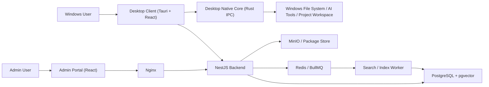

# 企业内网 Agent Skills 管理市场设计方案

## 1. 目标与约束

- 目标：构建企业内网部署的 Agent Skills 管理市场，支持 Skill 发布、审核、授权、搜索、安装、使用统计与本地多环境分发。
- 部署：服务端统一部署在 Linux 服务器，Nginx 反向代理，PostgreSQL 为主数据库。
- 用户：主要是 Windows 终端用户，需支持扫描本地 AI 工具路径并一键安装 Skill。
- 规模：500-3000 用户，约 1 万级 Skill。
- 技术路线：TypeScript + React + Tauri + Rust + NestJS + PostgreSQL + pgvector + Redis（任务队列/缓存）。
- 研发环境：开发机主要为 macOS，需要支持跨平台开发、联调和测试。

## 2. 推荐总体架构

推荐采用“模块化单体 + 独立检索管线”的架构。

### 2.1 逻辑组件

1. Desktop Client（Windows）
   - Tauri + React 桌面客户端。
   - 提供登录、Skill 浏览、搜索推荐、收藏评价、本地工具扫描、全局安装、项目安装、卸载和本地状态查看。

2. Admin Portal（Web）
   - React 管理后台。
   - 仅面向管理员、审核员、部门管理员使用。
   - 提供用户管理、部门管理、权限授予、审核流、工具路径模板维护、统计看板。

3. API Gateway / Backend（NestJS）
   - 统一对外 API。
   - 承担 IAM、RBAC、Skill 生命周期、审核流、安装任务编排、统计聚合、审计日志。

4. Search / Index Worker
   - 处理 Skill 内容抽取、切片、向量化、索引更新。
   - 提供检索召回、重排候选、搜索缓存。

5. PostgreSQL
   - 业务主库。
   - 使用 `pgvector` 存储向量。

6. Redis
   - BullMQ 队列、检索缓存、短期安装态缓存。

7. Object Storage / Package Store
   - 存储 Skill 压缩包、审核附件、版本文件。
   - 内网可用 MinIO 或直接 Linux 文件存储。

8. Desktop Native Core（Rust）
   - 内嵌在桌面客户端中，负责本机 AI 工具扫描、路径登记、安装/卸载、项目目录选择、安装结果回传。
   - 通过 Tauri IPC 与桌面前端通信，不再暴露 localhost 接口给浏览器。

### 2.2 交互流程

#### A. Skill 发布与审核

1. 用户或管理员在管理后台上传 Skill 包、描述、分类、标签、适配工具、可见范围。
2. Backend 保存元数据和文件，创建 `skill_version`、`review_task`。
3. 审核通过后，Skill 状态由 `DRAFT/PENDING_REVIEW` 变为 `PUBLISHED`。
4. Index Worker 异步抽取 Skill 内容，生成 embedding，写入向量索引表。

#### B. Skill 搜索与推荐

1. 用户在桌面客户端输入自然语言查询。
2. Backend 先做权限过滤，生成可见 Skill 范围约束。
3. Search Worker 对 query 向量化，执行“权限约束 + metadata filter + 向量检索 + 关键字召回”。
4. 将候选集合交给 LLM 做摘要与排序解释，返回推荐结果。

#### C. 一键安装

1. 桌面客户端读取本机 Native Core 状态与已发现工具列表。
2. 用户点击“一键安装”，桌面前端通过 Tauri IPC 调用 Native Core。
3. Native Core 根据 Path Registry 判断安装目标：
   - 全局工具目录
   - 项目工作区目录
4. Native Core 向 Backend 拉取安装清单和签名文件。
5. Native Core 安装成功后回传安装结果与遥测事件。

## 3. 系统架构图说明



### 3.1 模块边界

- 桌面前端负责普通用户交互，所有本地能力通过 IPC 调 Native Core。
- 管理后台只负责管理类页面，不承担本地扫描和安装。
- NestJS 统一承担鉴权、业务规则、审核、安装任务签发。
- Search Worker 独立处理 CPU 密集型 embedding 与检索任务。
- Desktop Native Core 只负责“本地环境事实”和“本地文件动作”，不承载企业权限逻辑。

## 4. 建议技术栈

### 4.1 前端

- React + TypeScript
- Ant Design 或 Semi Design 作为后台组件库
- TanStack Query 处理服务端状态
- WebSocket/SSE 处理审核状态与安装进度推送
- 桌面端通过 Tauri IPC 调用原生能力，不使用浏览器 localhost 通信

### 4.2 服务端

- NestJS
- Prisma 或 TypeORM（二选一，推荐 Prisma 做模式管理）
- BullMQ + Redis
- JWT + Session 双模式
- LDAP/SSO 预留为 `auth_provider`

### 4.3 检索

- PostgreSQL + `pgvector`
- 文本分词：中英文混合 tokenizer
- Embedding：
  - 首选内网 CPU 可部署的轻量模型，服务化运行
  - 示例策略：中文场景选择 bge-m3 / bge-small-zh 类模型
- Rerank：
  - 初期可用规则重排 + metadata boosting
  - 后续再引入轻量 reranker

### 4.4 本地客户端

- Windows Desktop Client：`Tauri + React`
- Native Core：`Rust`
- 如果强调桌面授权弹窗、文件选择器、系统托盘和自动更新，推荐 Tauri
- 本方案优先推荐：Tauri UI Shell + Rust Native Core

## 5. 数据库核心 ER 设计

## 5.1 核心实体

### user

- id
- username
- display_name
- email
- employee_no
- department_id
- status
- password_hash
- auth_source (`local`, `ldap`, `sso`)
- last_login_at
- created_at
- updated_at

### department

- id
- name
- code
- parent_id
- path
- created_at

说明：支持部门树，便于“本部门及子部门可见”的授权。

### role

- id
- code
- name
- description

### permission

- id
- code
- name
- resource
- action

### user_role

- user_id
- role_id
- scope_type (`global`, `department`, `personal`)
- scope_ref_id

### role_permission

- role_id
- permission_id

### skill

- id
- skill_key
- name
- summary
- description
- owner_user_id
- owner_department_id
- category_id
- status (`draft`, `pending_review`, `published`, `rejected`, `archived`)
- visibility_type (`public`, `department`, `private`)
- current_version_id
- average_rating
- favorite_count
- install_count
- invoke_count
- created_at
- updated_at

### skill_version

- id
- skill_id
- version
- package_uri
- manifest_json
- readme_text
- changelog
- ai_tools_json
- install_mode_json
- checksum
- signature
- review_status
- published_at
- created_by
- created_at

### skill_category

- id
- name
- parent_id

### skill_tag

- id
- name

### skill_tag_rel

- skill_id
- tag_id

### skill_permission_rule

- id
- skill_id
- rule_type (`view`, `use`, `manage`)
- subject_type (`all`, `department`, `user`)
- subject_ref_id
- effect (`allow`, `deny`)

说明：该表是精细授权核心。`visibility_type` 做粗粒度展示，`skill_permission_rule` 做最终裁决。

### review_task

- id
- skill_version_id
- submitter_id
- reviewer_id
- status
- comment
- created_at
- reviewed_at

### skill_favorite

- user_id
- skill_id
- created_at

### skill_rating

- id
- user_id
- skill_id
- rating
- comment
- created_at

### install_record

- id
- user_id
- skill_id
- skill_version_id
- target_type (`global_tool`, `project_workspace`)
- tool_type
- tool_instance_id
- workspace_path
- install_status
- installed_by (`cli`, `daemon`)
- installed_at
- uninstalled_at

### tool_instance

- id
- user_id
- tool_type
- tool_name
- os_type
- detected_path
- config_path
- skill_target_path
- detection_source
- is_verified
- last_scanned_at
- created_at

说明：存“用户机器上有哪些 AI 工具实例”，用于后续安装目标选择。

### workspace_registry

- id
- user_id
- workspace_name
- workspace_path
- repo_remote
- project_fingerprint
- created_at
- last_used_at

### daemon_device

- id
- user_id
- device_id
- device_name
- os_version
- daemon_version
- client_cert_fingerprint
- last_seen_at
- status

### audit_log

- id
- actor_user_id
- action
- resource_type
- resource_id
- payload_json
- ip
- created_at

### skill_document

- id
- skill_version_id
- chunk_index
- content
- token_count
- metadata_json
- embedding vector
- created_at

说明：用于 RAG 检索的切片表。

## 5.2 关键关系

- `department 1:N user`
- `user N:M role` 通过 `user_role`
- `role N:M permission` 通过 `role_permission`
- `skill 1:N skill_version`
- `skill N:M tag` 通过 `skill_tag_rel`
- `skill 1:N skill_permission_rule`
- `skill_version 1:N review_task`
- `skill_version 1:N skill_document`
- `user 1:N tool_instance`
- `user 1:N workspace_registry`
- `user 1:N daemon_device`
- `user 1:N install_record`

## 6. 权限模型设计

### 6.1 权限分层

1. 平台级 RBAC
   - 控制“谁能上传、审核、下架、查看报表、管理分类”。

2. Skill 级 ABAC/RBAC 混合
   - 控制“谁能看到 Skill、谁能安装 Skill、谁能管理 Skill”。

3. 本地设备级约束
   - 控制“哪些设备/Daemon 可以代表哪个用户执行安装”。

### 6.2 推荐可见性判定顺序

1. 管理员角色直接放行
2. `visibility_type=public` 且无显式 deny
3. `visibility_type=department` 且用户部门命中规则
4. `visibility_type=private` 且用户是 owner 或被显式授权
5. 若存在 `deny` 规则，优先级高于 `allow`

## 7. API 设计建议

### 7.1 Auth / IAM

- `POST /api/auth/login`
- `POST /api/auth/logout`
- `GET /api/auth/me`
- `POST /api/auth/ldap/callback`
- `GET /api/departments/tree`
- `GET /api/users`
- `POST /api/users/:id/roles`

### 7.2 Skill 生命周期

- `POST /api/skills`
- `PUT /api/skills/:id`
- `POST /api/skills/:id/versions`
- `POST /api/skills/:id/submit-review`
- `POST /api/reviews/:id/approve`
- `POST /api/reviews/:id/reject`
- `POST /api/skills/:id/publish`
- `POST /api/skills/:id/archive`

### 7.3 发现与互动

- `GET /api/skills`
- `GET /api/skills/:id`
- `POST /api/skills/:id/favorite`
- `DELETE /api/skills/:id/favorite`
- `POST /api/skills/:id/rating`
- `GET /api/leaderboards`
- `GET /api/dashboard/overview`

### 7.4 智能搜索

- `POST /api/search/skills`
- `GET /api/search/suggestions`
- `POST /api/search/feedback`

### 7.5 安装与 Daemon

- `GET /api/install/manifest/:skillVersionId`
- `POST /api/install/tasks`
- `POST /api/install/tasks/:id/report`
- `GET /api/tools/discovered`
- `POST /api/tools/report`
- `POST /api/workspaces/report`
- `POST /api/daemon/register`
- `POST /api/daemon/heartbeat`

## 8. 难点 A：Agent + RAG 智能搜索设计

## 8.1 问题拆解

当用户输入自然语言，例如“帮我找一个能自动生成前后端 API 接口的工具”时，系统需要完成四件事：

1. 理解意图：这是“代码生成 / 接口生成 / 前后端协同”的需求。
2. 权限约束：只能在用户可见、可用的 Skill 范围里检索。
3. 混合召回：从 1 万级 Skill 中找出语义相关、标签相关、工具兼容相关的候选。
4. 结果组织：用 LLM 解释为什么推荐，并输出可执行建议。

## 8.2 Skill 向量化对象

每个 Skill 不是只向量化一条描述，而是构造成多个“可检索文档块”：

1. 标题块
   - Skill 名称、简介、标签、分类、适配工具
2. Readme/说明块
   - 功能描述、使用方式、输入输出
3. Prompt/模板块
   - 核心 prompt 或指令样例
4. Manifest/配置块
   - 支持哪些工具、依赖哪些文件、安装到什么位置
5. 审核/质量摘要块
   - 管理员审核意见、质量标签、最佳使用场景

每个块单独 embedding，写入 `skill_document`。

## 8.3 上传后的索引流程

```text
用户上传 Skill
-> Backend 保存 skill_version
-> 投递 IndexJob 到 BullMQ
-> Worker 解压包并抽取文本
-> 规范化清洗（去模板噪音、保留标签/用途/工具元信息）
-> 切片（建议 300-800 tokens）
-> 生成 embedding
-> 写入 skill_document(embedding)
-> 更新 skill.search_status = ready
```

### 8.3.1 CPU-only 实时性策略

因为服务器没有 GPU，建议采用以下策略：

1. 模型选型偏轻量
   - 选择 CPU 友好的 embedding 模型，小模型优先。

2. 异步索引
   - 上传后立即返回“处理中”，不阻塞发布流程。

3. 增量更新
   - 仅对新版本重新抽取与向量化，不重复处理旧版本。

4. 分级索引
   - 先写 keyword 索引与 metadata，再补充 embedding 索引。
   - 这样 Skill 能快速可搜，语义检索几秒内补齐。

5. 低峰批处理
   - 审核通过后立即进队列，但大批量重建索引安排在夜间。

### 8.3.2 Embedding 策略建议

- Query Embedding 与 Document Embedding 使用同一模型，保证向量空间一致。
- 为中文主场景补充中英文混合文本预处理。
- 将关键 metadata 拼接到 chunk 前缀，例如：
  - `category:研发`
  - `tool:Cursor,Cline`
  - `department:平台研发`
  - `visibility:public`

这样能让 embedding 更感知业务语义。

## 8.4 搜索时的数据流

### 8.4.1 查询改写

用户输入：
`帮我找一个能自动生成前后端 API 接口的工具`

系统先生成结构化查询：

- intent: `api_generation`
- keywords: `API`, `前后端`, `接口生成`, `OpenAPI`, `SDK`, `client codegen`
- preferred_tools: 用户当前已安装工具
- department_scope: 当前用户部门

可用两种方式：

1. 规则 + 词典
   - 初期成本低，稳定。
2. 小模型 Query Rewriter
   - 后期效果更好。

推荐先用规则，再逐步引入小模型改写。

### 8.4.2 权限预过滤

检索前先得到当前用户的 `allowed_skill_ids` 或可表达为 SQL 的条件：

- 公开 Skill
- 用户所属部门 Skill
- 明确授权给用户的 Skill
- 排除 deny 规则与下架版本

这样搜索不会把无权限结果召回后再删掉，避免浪费检索成本，也避免提示词泄露。

### 8.4.3 混合召回

召回分三路并行：

1. 向量召回
   - 在 `skill_document` 上做 ANN / topK 检索
2. 关键词召回
   - 在 `skill.name/summary/tag/readme_text` 上做全文检索
3. 规则召回
   - 基于分类、标签、适配工具、排行榜热度兜底

将三路结果合并去重，得到约 50-100 个候选。

### 8.4.4 重排

重排分两层：

1. 规则重排
   - 权限完全匹配加分
   - 工具兼容加分
   - 高评分、高安装量加分
   - 最近活跃版本加分

2. LLM/Reranker 精排
   - 输入前 20 个候选的标题、摘要、标签、兼容工具
   - 输出 top 5-10 推荐

### 8.4.5 LLM 最终组织输出

LLM 不负责“从零搜索”，只负责整理候选结果，降低幻觉。

输出字段建议：

- `skill_id`
- `name`
- `why_matched`
- `supported_tools`
- `visibility_reason`
- `recommended_install_mode`
- `confidence_score`

## 8.5 鉴权与 RAG 融合机制

关键原则：鉴权前置，LLM 后置。

错误做法：

- 先全库向量检索，再把无权限结果过滤掉。

正确做法：

1. 后端根据用户身份构造权限条件。
2. Search Worker 只在权限范围内检索。
3. 返回候选时附带“权限命中原因”。
4. LLM 只能看到用户有权访问的候选。

这样既安全，也避免模型把不可见 Skill 的描述泄露给用户。

## 8.6 排行榜与搜索联动

排行榜不只看下载量，还应增加加权指标：

- 下载量
- 调用量
- 收藏量
- 平均评分
- 最近 30 天活跃度

在搜索重排中，将排行榜得分作为次级加权项，而不是主导项，避免热门 Skill 挤压长尾精品 Skill。

## 9. 难点 B：路径管理与一键安装设计

## 9.1 问题本质

不同 AI 工具的 Skill 存放目录不一致，且同一工具可能存在：

- 用户级全局目录
- 项目级工作区目录
- 多版本或多实例安装目录

因此必须把“平台逻辑”和“本地环境路径事实”解耦。

## 9.2 Path Registry 设计

在 Daemon 内维护 Path Registry，结构示意：

```json
{
  "toolType": "cursor",
  "toolName": "Cursor",
  "scope": "global",
  "detectRules": [
    "%APPDATA%/Cursor/User",
    "%LOCALAPPDATA%/Programs/Cursor"
  ],
  "configPath": "C:/Users/Alice/AppData/Roaming/Cursor/User",
  "skillTargetPath": "C:/Users/Alice/AppData/Roaming/Cursor/User/agent-skills",
  "isVerified": true,
  "lastScannedAt": "2026-04-01T10:00:00Z"
}
```

### 9.2.1 Path Registry 的来源

1. 内置规则库
   - Daemon 自带常见工具扫描规则
2. 用户授权修正
   - 首次扫描不到时，允许用户手工指定目录
3. 后台下发模板
   - 服务端统一维护最新工具适配规则，Daemon 定时拉取

### 9.2.2 扫描时机

1. 首次启动初始化扫描
2. 用户点击“重新扫描”
3. 工具版本变更后定时重扫
4. 安装失败时回退触发复检

## 9.3 全局 Skill 安装流程

1. Web 页查询本机 Daemon 在线状态。
2. 用户选择 Skill 和目标工具实例。
3. Web 向 Daemon 发送安装请求：
   - `skillVersionId`
   - `toolInstanceId`
   - `installMode=global`
4. Daemon 向 Backend 获取安装 manifest：
   - 文件列表
   - 签名
   - 目标目录规则
   - 安装后校验规则
5. Daemon 将 Skill 解包复制到 `skillTargetPath`。
6. 安装完成后执行本地校验并回传结果。

## 9.4 项目专属 Skill 工作区映射

推荐方案：Web 触发，Daemon 打开本地目录选择器。

流程：

1. 用户在 Web 上点击“安装到项目”。
2. Web 调用 Daemon 本地接口。
3. Daemon 弹出 Windows 文件夹选择器。
4. 用户选择项目根目录，例如 `D:\Projects\MyProject`。
5. Daemon 在项目根下创建隐藏目录，例如：
   - `D:\Projects\MyProject\.agentskills`
6. 将 Skill 安装到该目录，并写入本地清单：
   - `.agentskills/manifest.json`
   - `.agentskills/<skill-key>/<version>/...`
7. Daemon 回传 `workspace_path`、`project_fingerprint` 给 Backend。

### 9.4.1 项目目录结构建议

```text
MyProject/
  .agentskills/
    manifest.json
    frontend-lint-skill/
      1.2.0/
    api-contract-skill/
      0.9.1/
```

### 9.4.2 为什么不用直接写工具全局目录

因为项目专属 Skill 的目标是“只对这个项目生效”，必须和全局目录隔离。

推荐机制：

- Daemon 在安装项目 Skill 时，除了写 `.agentskills`，还写入工具桥接文件或软链接配置。
- 如果目标 AI 工具支持 workspace-level skill path，则直接注册该路径。
- 如果不支持，则在项目根生成工具兼容配置文件，显式指向 `.agentskills`。

## 9.5 桌面前端与 Native Core 通信机制

主方案推荐使用：

- `Tauri IPC`
- 桌面端内部事件总线推送安装进度

备选方案：

- 如果后续仍需支持纯 Web 触发本地安装，可退回 `localhost HTTP/WebSocket` 或 `Browser Extension + Native Helper`

### 9.5.1 推荐 IPC 命令

- `scan_tools`
- `list_tools`
- `install_skill`
- `uninstall_skill`
- `select_workspace`
- `verify_target_path`
- `list_local_installs`

### 9.5.2 安全机制

桌面一体化后，安全重点从“防止网页调用 localhost”转为“防止桌面端被伪造或离线包被篡改”：

1. 用户登录态绑定桌面客户端会话
2. Backend 签发 1-3 分钟有效的 install ticket
3. Native Core 使用 ticket 向 Backend 拉取 manifest
4. Skill 包使用 checksum + signature 校验
5. 设备注册可选使用设备证书或公私钥

安装请求链路：

`Desktop UI -> Backend 获取 install ticket -> Native Core 用 ticket 拉 manifest -> 本地安装 -> 回传状态`

## 9.6 卸载与版本升级

Daemon 应该维护本地安装清单，支持：

- 精准卸载某一版本
- 升级时先校验兼容性
- 回滚到上一版本

本地记录建议保存在：

- `%ProgramData%/Company/AgentMarketplace/installs.db`
  或
- `%AppData%/Company/AgentMarketplace/registry.json`

## 10. 难点 C：Mac 开发、Windows 桌面用户端、Linux 服务端的研发测试方案

## 10.1 开发分层策略

### 服务端开发

- 在 macOS 上本地开发 NestJS、PostgreSQL、Redis、MinIO。
- 使用 Docker Compose 拉起依赖。
- 保证镜像与生产 Linux 一致。

### Web 开发

- 在 macOS 上直接运行 React 管理后台开发服务器。
- 桌面端 UI 也可在 macOS 上以 Web 模式开发，但原生能力全部走 mock provider。

### 桌面 Native Core 开发

- 代码仓库保持跨平台编译，但 Windows 功能模块单独隔离：
  - `core`: 安装任务、manifest 校验、协议层
  - `windows_adapter`: 注册表扫描、已安装程序检测、Windows 文件选择器
  - `mock_adapter`: macOS 开发时提供假路径和假安装目标

## 10.2 本地联调方式

在 macOS 开发时，无法真实扫描 Windows 路径，因此建议三种联调层：

1. Mock 模式
   - Native Core mock 返回预置的工具实例和目录。
   - 用于桌面前端、后端、安装流程联调。

2. Contract Test
   - 基于 OpenAPI/JSON Schema 验证桌面端、管理后台、Backend 的协议一致性。

3. Windows Runner 测试
   - CI 中增加 Windows runner。
   - 自动运行桌面 Native Core 集成测试、真实路径映射测试、安装回归测试。

## 10.3 推荐开发与测试环境矩阵

| 维度 | macOS 开发机 | Linux 服务端 | Windows 客户端 |
|---|---|---|---|
| 管理后台 | 开发/单测/联调 | 部署验证 | 浏览器兼容验证 |
| 桌面前端 | 开发/单测/mock 联调 | 不适用 | 真实运行 |
| Backend | 开发/单测/集成 | 生产运行 | 不适用 |
| PostgreSQL/Redis/MinIO | Docker | 生产运行 | 不适用 |
| Native Core | 协议/单测/mock | 不适用 | 真实运行 |
| Windows Adapter | 仅交叉编译 | 不适用 | 真实扫描/安装 |

## 10.4 CI/CD 建议

### CI

1. macOS 或 Linux runner
   - lint
   - unit test
   - backend integration test
   - search pipeline test

2. Windows runner
   - native core unit/integration test
   - path registry detection test
   - workspace install/uninstall test

### CD

1. Backend 打包为 Docker 镜像，部署到 Linux
2. 桌面客户端打包为 Windows 安装包（MSI/EXE）
3. 管理后台静态资源由 Nginx 托管

## 10.5 研发期最重要的抽象边界

为了让 macOS 开发不被 Windows 阻塞，必须把下面两个接口抽象清楚：

1. `ToolDiscoveryProvider`
   - `scanInstalledTools()`
   - `verifyToolPath()`

2. `WorkspaceSelectorProvider`
   - `selectWorkspaceDirectory()`
   - `createSkillWorkspace()`

在 macOS 上用 mock 实现，在 Windows 上用真实实现。

## 11. 非功能性设计

### 11.1 安全

- 内网 HTTPS
- JWT + Refresh Token
- 审计日志全量记录
- 安装包签名校验
- Skill 包 checksum + signature
- Daemon 设备绑定

### 11.2 性能

- 1 万级 Skill 使用 PostgreSQL + pgvector 足够
- 热门榜单预聚合
- 检索结果缓存 30-120 秒
- 统计异步写入

### 11.3 可观测性

- 后端：Prometheus + Grafana
- 日志：结构化 JSON
- 安装链路 trace_id 贯穿 Web、Backend、Daemon

## 12. 分阶段落地建议

### Phase 1：最小可用

- 本地账号登录
- 基础 RBAC
- Skill 上传、审核、发布
- 分类标签、收藏评价
- 关键词搜索 + metadata 过滤
- Daemon 扫描 2-3 个主流工具
- 全局安装、项目安装

### Phase 2：智能化增强

- embedding 索引
- 混合召回
- 简单 LLM 总结
- 排行榜和数据看板
- 项目目录桥接优化

### Phase 3：企业化增强

- LDAP/SSO
- 多级审批
- 细粒度 deny 规则
- 证书级设备信任
- 更完整的工具适配生态

## 13. 推荐结论

最适合当前约束的方案是：

- 服务端：`Nginx + React + NestJS + PostgreSQL + pgvector + Redis + MinIO`
- 普通用户端：`Tauri Desktop Client + Rust Native Core`
- 管理端：`React Admin Portal`
- 检索：`模块化单体 + Index/Search Worker`
- 客户端通信：`Tauri IPC`
- 搜索：`权限前置过滤 + 混合召回 + LLM 后置整理`
- 安装：`Path Registry + Workspace Mapping + Install Ticket`
- 研发：`macOS 开发 + Docker 服务依赖 + Windows Runner 集成测试`

这套方案兼顾了内网可部署性、安全性、跨平台研发效率，以及未来从 1 万级 Skill 往更高规模扩展的空间。

## 14. 补充修订（2026-04-01）

### 14.1 两阶段索引替代“仅标题向量化”

不建议只对标题块做向量化，因为这会显著损失自然语言召回质量，尤其当 Skill 名称较泛、真正有效信息主要存在于摘要、README、Prompt 和 Manifest 中时。

推荐改为两阶段：

1. 即时索引层
   - 上传后立刻对“标题 + 摘要 + 标签 + 分类 + 适配工具 + 审核标签”生成一个轻量 search card embedding
   - 目标是几秒内可检索

2. 深度索引层
   - 异步对 README、Prompt、Manifest、示例用法分块 embedding
   - 目标是提升长尾自然语言搜索质量

### 14.2 管理端与部门管理员

平台应明确包含“用户端 + 管理端”双视图：

- 用户端：搜索、收藏、安装、评价、查看我的设备与工作区
- 管理端：用户管理、部门管理、权限授予、审核流、分类标签维护、工具路径模板维护、统计看板

推荐角色：

- `platform_admin`：全局平台管理
- `security_admin`：权限与审计
- `dept_admin`：仅管理本部门及子部门用户、Skill、审核任务
- `reviewer`：审核 Skill
- `normal_user`：普通上传、搜索、安装、评价

推荐继续使用 `user_role(scope_type=department, scope_ref_id=department_id)` 表达“部门管理员”的范围，不必额外新造一套权限引擎。

### 14.3 浏览器插件方案定位

纯“网页版 + 浏览器插件”不足以完全替代本地原生组件，原因是：

- 浏览器对本地文件系统访问受限
- 无法稳定扫描任意 AI 工具安装目录
- 无法无感写入用户未明确授权的路径

如果不希望部署常驻 Daemon，较现实的替代是：

- `Web + Browser Extension + Native Messaging Helper`

即插件负责页面桥接和用户态交互，本地 Helper 负责真实文件访问和路径探测。它比常驻 Daemon 更轻，但本质上仍是本地原生代理。

### 14.4 工具路径模板表

不同 AI 工具、不同版本、不同作用域下的安装路径不应硬编码在 Daemon 里，而应由服务端维护一套“工具路径模板表”。

建议新增：

#### ai_tool_catalog

- id
- tool_code
- tool_name
- vendor
- supported_os_json
- official_doc_url
- is_active
- created_at
- updated_at

#### ai_tool_install_target_template

- id
- tool_id
- artifact_type (`skill`, `rule`, `instruction`, `config`, `agents_md`)
- scope_type (`global`, `project`)
- target_path_template
- packaging_mode (`single_file`, `directory`, `merge`, `append`)
- filename_template
- path_variables_json
- min_tool_version
- max_tool_version
- priority
- is_default
- source_reference_url
- created_at
- updated_at

#### ai_tool_detection_rule

- id
- tool_id
- os_type
- detection_type (`path_exists`, `registry`, `process`, `config_file`)
- rule_expr
- expected_install_path
- expected_config_path
- expected_target_path
- priority
- is_active
- created_at

### 14.5 项目级路径不再固定为统一目录

项目级安装路径必须按目标 AI 工具区分，而不是强行统一到 `.agentskills`。平台保存的应是“工具路径模板”，由用户在安装时明确选择目标工具，再由本地组件解析实际落盘位置。

示例：

- Cursor：`${workspaceRoot}/.cursor/rules/`
- Cline Skills：`${workspaceRoot}/.cline/skills/<skill-key>/`
- Cline Rules：`${workspaceRoot}/.clinerules/`
- OpenCode：`${workspaceRoot}/.opencode/skills/<skill-key>/` 或相关配置路径
- Codex：优先考虑 `${workspaceRoot}/AGENTS.md`，项目级 skills 目录需等待更稳定的官方约定后再固化
